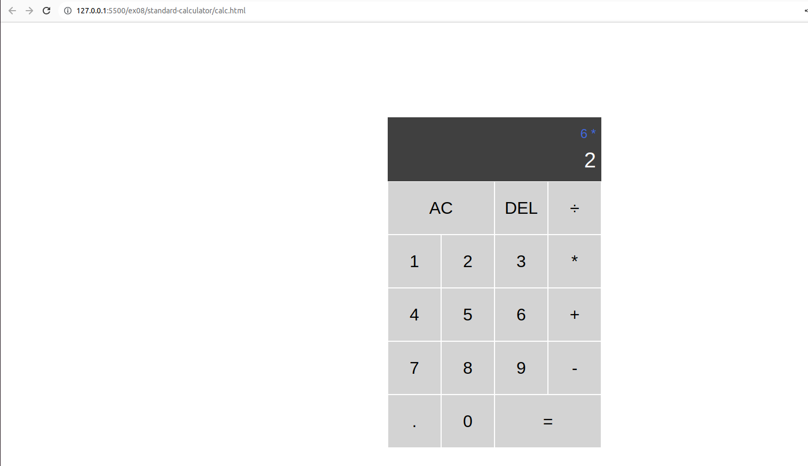

# Design of a Standard Calculator

## AIM:

To design a web application for a standard calculator.

## DESIGN STEPS:

### step 1:
Clone the github repository and create Django admin interface.

### Step 2:
Change settings.py file to allow request from all hosts.

### Step 3:
Use CSS for creating attractive colors.

### Step 4:
Write JavaScript program for implementing five different operations.

### Step 5:

Publish the website in the given URL.

## PROGRAM :
```html
calc.html
<!DOCTYPE html>
<html lang="en">
<head>
  <meta charset="UTF-8">
  <meta name="viewport" content="width=device-width, initial-scale=1.0">
  <meta http-equiv="X-UA-Compatible" content="ie=edge">
  <title>Calculator</title>
  <link href="styles.css" rel="stylesheet">
  <script src="script.js" defer></script>
</head>
<body>
  <div class="calculator-grid">
    <div class="output">
      <div data-previous-operand class="previous-operand"></div>
      <div data-current-operand class="current-operand"></div>
    </div>
    <button data-all-clear class="span-two">AC</button>
    <button data-delete>DEL</button>
    <button data-operation>÷</button>
    <button data-number>1</button>
    <button data-number>2</button>
    <button data-number>3</button>
    <button data-operation>*</button>
    <button data-number>4</button>
    <button data-number>5</button>
    <button data-number>6</button>
    <button data-operation>+</button>
    <button data-number>7</button>
    <button data-number>8</button>
    <button data-number>9</button>
    <button data-operation>-</button>
    <button data-number>.</button>
    <button data-number>0</button>
    <button data-equals class="span-two">=</button>
  </div>
</body>
</html>

<script>
    class Calculator {
  constructor(previousOperandTextElement, currentOperandTextElement) {
    this.previousOperandTextElement = previousOperandTextElement
    this.currentOperandTextElement = currentOperandTextElement
    this.clear()
  }

  clear() {
    this.currentOperand = ''
    this.previousOperand = ''
    this.operation = undefined
  }

  delete() {
    this.currentOperand = this.currentOperand.toString().slice(0, -1)
  }

  appendNumber(number) {
    if (number === '.' && this.currentOperand.includes('.')) return
    this.currentOperand = this.currentOperand.toString() + number.toString()
  }

  chooseOperation(operation) {
    if (this.currentOperand === '') return
    if (this.previousOperand !== '') {
      this.compute()
    }
    this.operation = operation
    this.previousOperand = this.currentOperand
    this.currentOperand = ''
  }

  compute() {
    let computation
    const prev = parseFloat(this.previousOperand)
    const current = parseFloat(this.currentOperand)
    if (isNaN(prev) || isNaN(current)) return
    switch (this.operation) {
      case '+':
        computation = prev + current
        break
      case '-':
        computation = prev - current
        break
      case '*':
        computation = prev * current
        break
      case '÷':
        computation = prev / current
        break
      default:
        return
    }
    this.currentOperand = computation
    this.operation = undefined
    this.previousOperand = ''
  }

  getDisplayNumber(number) {
    const stringNumber = number.toString()
    const integerDigits = parseFloat(stringNumber.split('.')[0])
    const decimalDigits = stringNumber.split('.')[1]
    let integerDisplay
    if (isNaN(integerDigits)) {
      integerDisplay = ''
    } else {
      integerDisplay = integerDigits.toLocaleString('en', { maximumFractionDigits: 0 })
    }
    if (decimalDigits != null) {
      return `${integerDisplay}.${decimalDigits}`
    } else {
      return integerDisplay
    }
  }

  updateDisplay() {
    this.currentOperandTextElement.innerText =
      this.getDisplayNumber(this.currentOperand)
    if (this.operation != null) {
      this.previousOperandTextElement.innerText =
        `${this.getDisplayNumber(this.previousOperand)} ${this.operation}`
    } else {
      this.previousOperandTextElement.innerText = ''
    }
  }
}


const numberButtons = document.querySelectorAll('[data-number]')
const operationButtons = document.querySelectorAll('[data-operation]')
const equalsButton = document.querySelector('[data-equals]')
const deleteButton = document.querySelector('[data-delete]')
const allClearButton = document.querySelector('[data-all-clear]')
const previousOperandTextElement = document.querySelector('[data-previous-operand]')
const currentOperandTextElement = document.querySelector('[data-current-operand]')

const calculator = new Calculator(previousOperandTextElement, currentOperandTextElement)

numberButtons.forEach(button => {
  button.addEventListener('click', () => {
    calculator.appendNumber(button.innerText)
    calculator.updateDisplay()
  })
})

operationButtons.forEach(button => {
  button.addEventListener('click', () => {
    calculator.chooseOperation(button.innerText)
    calculator.updateDisplay()
  })
})

equalsButton.addEventListener('click', button => {
  calculator.compute()
  calculator.updateDisplay()
})

allClearButton.addEventListener('click', button => {
  calculator.clear()
  calculator.updateDisplay()
})

deleteButton.addEventListener('click', button => {
  calculator.delete()
  calculator.updateDisplay()
})

</script>


<style>
*, *::before, *::after {
  box-sizing: border-box;
  font-family: Gotham Rounded, sans-serif;
  font-weight: normal;
}

body {
  padding: 0;
  margin: 0;
  background:(to right,lightsteelblue,lemonchiffon);
}

.calculator-grid {
  display: grid;
  justify-content: center;
  align-content: center;
  min-height: 100vh;
  grid-template-columns: repeat(4, 100px);
  grid-template-rows: minmax(120px, auto) repeat(5, 100px);
}

.calculator-grid > button {
  cursor: pointer;
  font-size: 2rem;
  border: 1px solid white;
  outline: none;
  background-color: lightgrey;
}

.calculator-grid > button:hover {
  background-color:lightyellow;
}

.span-two {
  grid-column: span 2;
}

.output {
  grid-column: 1 / -1;
  background-color: rgba(0, 0, 0, .75);
  display: flex;
  align-items: flex-end;
  justify-content: space-around;
  flex-direction: column;
  padding: 10px;
  word-wrap: break-word;
  word-break: break-all;
}

.output .previous-operand {
  color:royalblue;
  font-size: 1.5rem;
}

.output .current-operand {
  color: white;
  font-size: 2.5rem;
}
</style>

```
## OUTPUT:

## Result:
The program is executed successfully.
